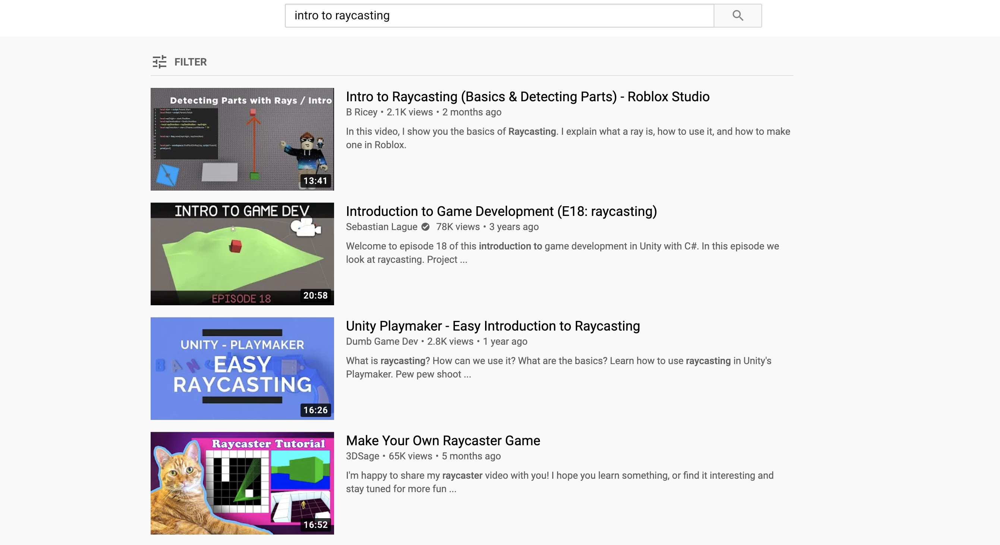

# Intro to Intro to Raycasting--#1

> "*...If you don't know, now you know..."* - **Notorious B.I.G** (1994)

이 글은 필자가 [42 Seoul](http://42seoul.kr) 에서 주어진 프로젝트 과제인 'cub3d'—울펜슈타인 3D의 엔진을 C로 재현 해보는—과제를 진행 하면서 보고 배우고 느낀 점들을 정리 하기 위해 작성한 글이다.

[Lodev.com](http://lodev.com) 의 'Intro to Raycasting' 을 기반으로 하여, 문서에서 나온 부분에 관련 지식이 전혀 없는 상태에서 어떤 점들을 알고 학습하는데 도움 을 위한 목적으로 작성하였다.

---
### II2R--Intro to Intro to Raycasting
#### 👉 <a href="https://github.com/sungyongcho/ii2r/blob/master/md/1.md">#1</a>
#### 👉 <a href="https://github.com/sungyongcho/ii2r/blob/master/md/2.md">#2</a>
#### 👉 <a href="https://github.com/sungyongcho/ii2r/blob/master/md/3.md">#3</a>
#### 👉 <a href="https://github.com/sungyongcho/ii2r/blob/master/md/4.md">#4</a>
#### 👉 <a href="https://github.com/sungyongcho/ii2r/blob/master/md/5.md">#5</a>
#### 👉 <a href="https://github.com/sungyongcho/ii2r/blob/master/md/6.md">#6</a>
---

42 Seoul 이란?

👉[https://42seoul.kr/about](https://42seoul.kr/about)

---

42?

👉[https://www.42.fr/](https://www.42.fr/)

---
<br>

## #1
우선 cub3d 과제를 진행 하기 전에 아주 오래 전, 몇 번의 평가—상호 평가;peer evaluation—들을 통하여 cub3d과제를 진행 하면서 주의 해야 할 것들을 간단하게나마 메모 해 놓았었다.

- minilibx (자체 제공 라이브러리; [https://github.com/42Paris/minilibx-linux/blob/master/README.md](https://github.com/42Paris/minilibx-linux/blob/master/README.md))
- 맵
    - 파싱 (문자열 처리)
    - validity check
- 구조체
- memory leak (메모리 누수; malloc 이용, 해제 등 )
- 레이캐스팅
    - 벡터
    - 삼각함수

맵의 경우는, 하다 보니까 문자열 처리의 부분이라 따로 서술 하지 않고, 구조체의 경우는 클러스터에서 과제를 완수하신 분들에게 물어 물어 다음과 같은 대답들을 들을 수 있었다.

```
'구조체 안에 필요한 값들의 변수들을 전부 다 집어 넣어 처리 해야 되기 때문에 변수가 25~30개 정도 였었던것 같다'
```

이 글이 cub3d를 진행하기 위한 매우 첫번째 단계라면, 도대체 이게 무슨 말인지 모를 수도 있다. cub3d 과제를 진행 하려면 분명 ft_printf를 진행 했을테고, 나의 경우 ft_printf 과제를 할 때 구조체를 활용 하였기 때문에 구조체에 대한 설명/지식이 따로 필요 하진 않았다. 다만 이야기 하고 싶은건, 앞으로 필요할 변수들이 '생각보다' 많기 때문에 구조체를 사용하여야 한다. (안해도 되는지 사실 모르겠는데 하여야 한다.)

memory leak의 경우에도 원인은, '생각보다 많은' 변수들 때문에 문제가 많이 발생 하는것으로 아는데, 이에 대한 해결 방법은 다른 곳에서 찾길 바란다.

---

추천 도서

- Understanding and Using C Pointers: Core Techniques for Memory Management (한글판 있음)

[Understanding and Using C Pointers: Core Techniques for Memory Management](https://www.amazon.com/Understanding-Using-Pointers-Techniques-Management/dp/1449344186)

---

minilibx가 뭔지 알려면 인트라에서 아래 동영상 두개는 꼭 시청하고 오길 바란다 (42 cadet 전용)

---

- [https://elearning.intra.42.fr/notions/minilibx/subnotions/mlx-introduction/videos/introduction-to-minilibx](https://elearning.intra.42.fr/notions/minilibx/subnotions/mlx-introduction/videos/introduction-to-minilibx)
- [https://elearning.intra.42.fr/notions/minilibx/subnotions/mlx-events/videos/minilibx-events](https://elearning.intra.42.fr/notions/minilibx/subnotions/mlx-events/videos/minilibx-events)

---

이 두개 동영상으로 일단 대충 minilibx가 어떤 역할을 하는것인지는 감이 잡혔는데... 과제의 pdf에도 나와 있는 raycasting은 도대체 무슨 말일까?

과제를 해결하기 위해 슬랙에서 이전 아카이브들을 검색 했었을 때, 두가지의 튜토리얼을 사용하여 과제를 해결 한 경우를 많이 볼 수 있었다.

- Lode's Computer Graphics Tutorial ([https://lodev.org/cgtutor/raycasting.html](https://lodev.org/cgtutor/raycasting.html))
    - 사이트 이름이 [lodev.org](http://lodev.org) 라 로데브 로데브 하는듯
    - C++로 작성되어 있음; 코드를 살펴보면 알겠지만 문법이 조금 다름
- Raycasting Basics with JavaScript ([https://courses.pikuma.com/courses/raycasting](https://courses.pikuma.com/courses/raycasting))
    - 역시 사이트 이름이 피쿠마 라서 피쿠마 피쿠마 하는듯 하다
    - 무료 코스이지만 회원가입이 필요하다.
    - 제목에서도 나와 있지만 자바스크립트로 작성되어 있음

여기에 내가 과제를 진행 할 때 쯤 이미 cub3d를 끝낸 선구자들이 꽤 많이 있었기 때문에, 클러스터 안에서 해당 cadet분들의 자료를 많이 참고 했다는 이야기를 들을 수 있었다. (물론 나도 정말 많이 도움 받음)

- mihykim ([https://github.com/365kim/raycasting_tutorial](https://github.com/365kim/raycasting_tutorial))
    - 위의 '로데브'를 한글로 번역 (플러스 알파) 하심
- taelee ([https://github.com/taelee42/mlx_example](https://github.com/taelee42/mlx_example))
    - minilibx 예제를 직접 작성하심
- yohlee ([https://github.com/l-yohai/cub3d](https://github.com/l-yohai/cub3d))
    - '로데브' 에 나와있는 코드를 C로 포팅함

이 레포들을 참고해서 git clone → git push 를 해도 물론 상관은 없다. 당연히 내가 책임은 안진다.

처음 위의 의 사이트들을 보았을 때 도대체 무슨 소린지 하나도 모르겠었다. 절실함이 덜하기도 해서 글을 그냥 대충 읽고 넘어 가기도 했고, 이해를 하려는 노력을 하지도 않았다.

혹시나 싶어, 막무가내로 유투브에 intro to raycasting을 검색했는데, 아래와 같은 동영상들이 나와 있었다.

<p align="center">
	
</p>

첫번째는 로블록스라는 게임과 관련 있어 보여서 스킵, 두번째는 유니티, c#이라고 나와있어서 넘기고, 세번째도 섬네일에 unity 라고 나와 있어서 넘기고, 네번째 그림에 웬 고양이와 raycaster tutorial이라는 말이 나와 있어서 한번 눌러 보았다.

- Make Your Own Raycaster Game ([https://www.youtube.com/watch?v=gYRrGTC7GtA](https://www.youtube.com/watch?v=gYRrGTC7GtA))
    - '고양이' 라고 불림

동영상을 대충 보니 일단

```jsx
1. OpenGL을 사용하지만, C로 raycasting을 구현 한다고 하였고,
2. 영상으로 raycasting이 어떤 식으로 작동 하는지 설명 해주어서
```

안일한 생각으로 '아 내가 이 동영상을 보고 opengl 부분만 잘 수정해서 minilibx에 맞게 수정하면 금방 완성해서 뚝딱 할수 있겠지??' 라는 생각으로 일단 이 영상으로 달려 들었다. 결론은, 위의 동영상은 어느 지점에서 구현의 한계에 부딫혀 '로데브' 자료를 참고하여 코드를 작성 하였지만, raycasting의 원리를 영상으로 쉽게 이해 할 수 있고, minilibx에 맞게 튜토리얼에 나온 코드를 수정 해야 하긴 하지만, 직접 따라 구현 해 볼 수 있도록 작성 되어 있어서 큰 도움이 되었다. 그래서, 이 영상은 못해도 한번은 꼭 정주행 하였으면 한다.

이 영상의 존재가 글을 작성 하게 된 가장 큰 계기이기도 한데, 영상으로 대략적인 레이캐스팅 개념의 이해와, 뭔가 어려워보이는 '로데브' 사이트의 설명의 간극을 채워 나갈 수 있는 설명이 되었으면 한다.

## 👉 <a href="https://github.com/sungyongcho/ii2r/blob/master/md/2.md"> #2 보러가기</a>
