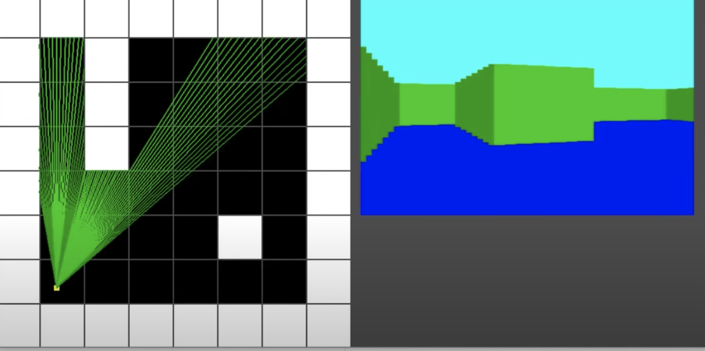
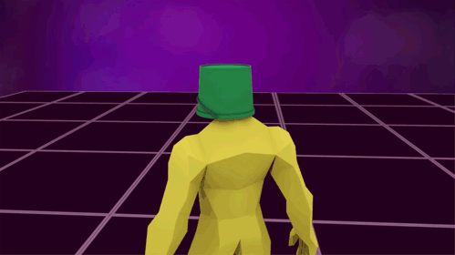
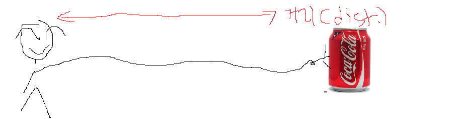
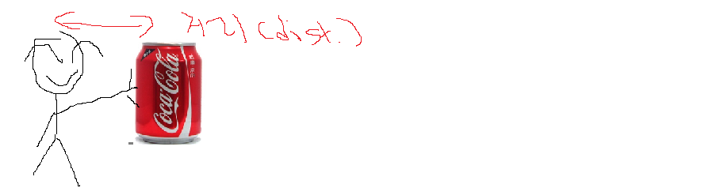

# Intro to Intro to Raycasting--#2

> "*...If you don't know, now you know..."* - **Notorious B.I.G** (1994)

그러면 도대체 레이캐스팅은 무엇인가?

일단 사전에 raycasting을 검색 해 보니 다음과 같은 정의가 나왔다.

```jsx
Ray Casting
광선 투사

[영상처리] 보는 이의 시점(또는 카메라의 시점)에서부터 특정 픽셀을 통해 빛을 투사(cast)해서
이 빛이 물체에 닿거나 보이는 영역에서 벗어날 때까지 따라감으로서, 해당 픽셀의 색을 결정해 렌더링
이미지를 생성하는 방식이다. 빛이 아무 물체에도 닿지 않는다면 해당 픽셀은 검은색이 되고,
빛이 어떤 객체(오브젝트) 표면에 도달하게 되면 프로그램은 그 빛이 hitting된 지점에서의 객체
색상을 계산해서 그 값을 해당 픽셀의 색으로 결정한다. 생성될 전체 이미지의 각각의 픽셀마다 순차적으로
위와 같은 과정을 반복한다.

Ray casting은 작업 공간에 존재하는 객체가 여러 개라고 할지라도 그 계산 방식의 특성상 각각 따로
존재하는 것처럼 렌더링하기 때문에 물체간의 반사나 투명도가 있는 물체를 표현하거나 물체 서로 간에
그림자를 드리우는 효과를 계산할 수가 없다. 따라서 그러한 효과를 흉내 내기 위해서 일종의 편법들을
사용하게 되는데 예를 들어, 표면 반사를 위해서는 reflection mapping을 사용하고, 투명 객체를
위해서는 겹쳐지는 두 객체의 색상을 섞어서 (물론 이때 굴절은 기대할 수 없지만) 사용하며,
그림자는 z-buffer의 정보를 적절히 활용해서 만들어 주게 된다.
[네이버 지식백과] Ray Casting - 광선 투사 (지형 공간정보체계 용어사전, 2016. 1. 3., 이강원, 손호웅)
https://terms.naver.com/entry.nhn?docId=3481586&cid=58439&categoryId=58439
```

너무 어렵다. 혹시나 싶어 조금 더 쉽게 풀이 해 보자면.. x-ray 라는 말은 들어 봤는가? 당연히 있을테고, ray라는 것은 결국 광선을 의미하고, casting 은 캐스팅을 한다는 것이다(?!). ray casting을 한다는 것이다.



(C) 3DSage

'고양이' 동영상에서 따온 그림인데, 그림을 자세히 보면, 왼쪽 그리드(격자)들에 흰색 박스들과 검정색 박스들 안에 노란 점과 초록색 선들이 보일텐데, 오른쪽 그림을 자세히 보면, 이 2D형태의 그림을 3D 형태로 표현 해 놓은것 처럼 보이는것 같다.

```jsx
- 노란색 점부터 흰색 벽과 맞닿아 있는 초록색 선들을 자세히 살펴보면, 오른쪽 화면의 초록색 벽같이 생긴
  무언가와 거리가 비슷해 보이고, 음영 처리가 되어있는것 처럼 보인다
- 이를 위에서 설명한 ray casting의 개념으로 생각 해 보면, 노란색 점에서 시작한 초록색 광선(빛)이,
	흰색의 벽에 닿았을 때 내 눈으로 어떻게 돌아 오는가? 를 컴퓨터 화면에 구현한 것이 레이캐스팅 인것이다.
```

아래 사진을 한번 확인 하지면, (고양이 1:53-1:22)



(C) 3DSage

내가 위치 하는 곳에서 아래의 노란색 빛을 쏜 다음,  **내가 있는 위치**에서 부터 광선들을 쏘아, **벽이 위치 하는 곳** 까지의 ***거리***를 확인 할 수 있다.

**나의 시점** 에서 벽까지의 거리를 알게 된다면, 벽이 얼마나 멀리 위치하고 있는지 알 수 있게 되고, **나의 시점** 에서 얼벽이 얼마나 멀리 위치하는지 알게 된다면, **내 눈**에 얼마나 크고 작게 보일지도 알 수 있게 된다.

아직도 이해가 안된다고? 아래 그림을 확인해보자.




콜라광고 아님



콜라캔이 내 눈에서 가까워질수록, 내 눈에서 콜라캔이 점점 더 커 보이게 된다. 당연한 이야기이지만, **내가 위치하는 곳**에서, **콜라캔이 위치하는 거리**가 점점 더 가까워지기 때문이다. 더 당연한 이야기이지만, **내가 위치하는 곳**에서, **콜라캔이 위치하는 거리**가 멀어질수록, 콜라캔은 점점 더 작아져 보이게 된다.

그리고 위의 내용을 다시 한번 읽어보면...

```jsx
'...노란색 점에서 시작한 초록색 광선(빛)이,
흰색의 벽에 닿았을 때 내 눈으로 어떻게 돌아 오는가? 를 컴퓨터 화면에 구현한 것이
레이캐스팅 인것이다...'
```

이제 레이캐스팅의 원리를 이해 하였으니까, 직접 구현만 하면 되는데, 어떻게 해야할까?
