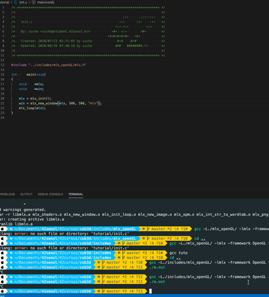
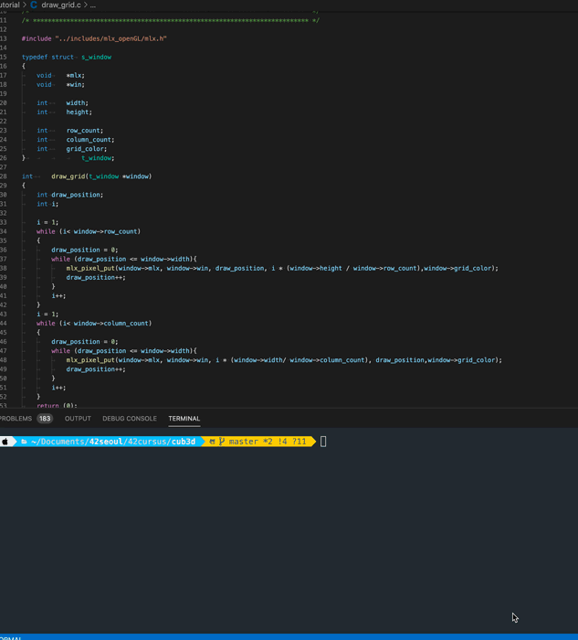

# Intro to Intro to Raycasting--#3

> "*...If you don't know, now you know..."* - **Notorious B.I.G** (1994)

일단 나의 경우, 위에서 이야기 한 것처럼 고양이 동영상을 보고 따라 하면서 직접 구현 해본 다음, cub3d 과제의 제약사항에 맞게 과제를 수정 해나가는 식의 과정을 밟아가기로 계획하였다.
<p align="center">
  
</p>
인트라 elearning minilibx 예제를 보고, 창을 띄운 다음에

```c
/* ************************************************************************** */
/*                                                                            */
/*                                                        :::      ::::::::   */
/*   init.c                                             :+:      :+:    :+:   */
/*                                                    +:+ +:+         +:+     */
/*   By: sucho <sucho@student.42seoul.kr>           +#+  +:+       +#+        */
/*                                                +#+#+#+#+#+   +#+           */
/*   Created: 2020/07/22 02:31:03 by sucho             #+#    #+#             */
/*   Updated: 2020/09/26 07:48:18 by sucho            ###   ########.fr       */
/*                                                                            */
/* ************************************************************************** */

#include "../includes/mlx_openGL/mlx.h"

int		main(void)
{
	void	*mlx;
	void	*win;

	mlx = mlx_init();
	win = mlx_new_window(mlx, 500, 500, "mlx");
	mlx_loop(mlx);
}
```

```
minilibx 다운 받으셔서 압축 푸신다음에 안에서 라이브러리 빌드 한번 하시고
gcc -L[minilibx 경로] -lmlx -framework OpenGL -framework Appkit init.c
로 컴파일하세요
```

<p align="center">
	
</p>

'고양이' 예제처럼 윈도우 안에 그리드(격자)를 출력 하고

```c
/* ************************************************************************** */
/*                                                                            */
/*                                                        :::      ::::::::   */
/*   draw_grid.c                                        :+:      :+:    :+:   */
/*                                                    +:+ +:+         +:+     */
/*   By: sucho <sucho@student.42seoul.kr>           +#+  +:+       +#+        */
/*                                                +#+#+#+#+#+   +#+           */
/*   Created: 2020/07/22 02:31:03 by sucho             #+#    #+#             */
/*   Updated: 2020/09/26 08:02:06 by sucho            ###   ########.fr       */
/*                                                                            */
/* ************************************************************************** */

#include "../includes/mlx_openGL/mlx.h"

typedef struct	s_window
{
	void	*mlx;
	void	*win;

	int		width;
	int		height;

	int		row_count;
	int		column_count;
	int		grid_color;
}				t_window;

int		draw_grid(t_window *window)
{
	int	draw_position;
	int	i;

	i = 1;
	while (i< window->row_count)
	{
		draw_position = 0;
		while (draw_position <= window->width){
			mlx_pixel_put(window->mlx, window->win, draw_position, i * (window->height / window->row_count),window->grid_color);
			draw_position++;
		}
		i++;
	}
	i = 1;
	while (i< window->column_count)
	{
		draw_position = 0;
		while (draw_position <= window->width){
			mlx_pixel_put(window->mlx, window->win, i * (window->width/ window->column_count), draw_position,window->grid_color);
			draw_position++;
		}
		i++;
	}
	return (0);
}

int		main(void)
{
	t_window window;

	window.width = 500;
	window.height = 500;
	window.row_count = 10;
	window.column_count = 10;
	window.grid_color = 0x00FFFF;
	window.mlx = mlx_init();
	window.win = mlx_new_window(window.mlx, window.width, window.height, "mlx_grid");

	mlx_loop_hook(window.mlx, draw_grid, &window);
	mlx_loop(window.mlx);
}
```
<p align="center">
<iframe src="../images/third_tutorial.mov" frameborder="0" width="560" height="315"
allow="accelerometer; autoplay; encrypted-media; gyroscope; picture-in-picture"
allowfullscreen>
</iframe>
</p>
그리드 안 중간쯤에  빨간점이 엄~~~~~~청 작게 나오는데 잘 확인 해보시길.

격자 안에 플레이어의 위치가 되는 점을 하나 찍어 보고 키 입력도 받아야되니까, wasd 키로 플레이어의 점이 왔다갔다 하는지 확인 해보았다.

```c
/* ************************************************************************** */
/*                                                                            */
/*                                                        :::      ::::::::   */
/*   move_player.c                                      :+:      :+:    :+:   */
/*                                                    +:+ +:+         +:+     */
/*   By: sucho <sucho@student.42seoul.kr>           +#+  +:+       +#+        */
/*                                                +#+#+#+#+#+   +#+           */
/*   Created: 2020/07/22 02:31:03 by sucho             #+#    #+#             */
/*   Updated: 2020/09/26 08:30:04 by sucho            ###   ########.fr       */
/*                                                                            */
/* ************************************************************************** */

#include "../includes/mlx_openGL/mlx.h"
# define KEY_W 13
# define KEY_A 0
# define KEY_S 1
# define KEY_D 2

typedef struct	s_player
{
	int			x;
	int			y;
	int			color;
}				t_player;

typedef struct	s_window
{
	void	*mlx;
	void	*win;
	t_player player;

	int		width;
?	int		height;

	int		row_count;
	int		column_count;
	int		grid_color;
}				t_window;

int		draw_grid(t_window *window)
{
	int	draw_position;
	int	i;

	i = 1;
	while (i< window->row_count)
	{
		draw_position = 0;
		while (draw_position <= window->width){
			mlx_pixel_put(window->mlx, window->win, draw_position, i * (window->height / window->row_count),window->grid_color);
			draw_position++;
		}
		i++;
	}
	i = 1;
	while (i< window->column_count)
	{
		draw_position = 0;
		while (draw_position <= window->width){
			mlx_pixel_put(window->mlx, window->win, i * (window->width/ window->column_count), draw_position,window->grid_color);
			draw_position++;
		}
		i++;
	}
	return (0);
}

void	init_player(t_window *window)
{
	mlx_pixel_put(window->mlx, window->win, window->player.x, window->player.y, window->player.color);
}

void	move_dot_left(t_window *window)
{
	int	old_x = window->player.x;
	int old_y = window->player.y;
	int	black = 0x000000;
	if ((0 < window->player.x && window->player.x <= window->width) &&
		(0 < window->player.y && window->player.x <= window->height))
	{
		//draw old spot with black first
		mlx_pixel_put(window->mlx, window->win, old_x, old_y, black);
		//then draw new spot
		mlx_pixel_put(window->mlx, window->win, --window->player.x, window->player.y, window->player.color);
	}
}

void	move_dot_right(t_window *window)
{
	int	old_x = window->player.x;
	int old_y = window->player.y;
	int	black = 0x000000;
	if ((0 < window->player.x && window->player.x <= window->width) &&
		(0 < window->player.y && window->player.x <= window->height))
	{
		//draw old spot with black first
		mlx_pixel_put(window->mlx, window->win, old_x, old_y, black);
		//then draw new spot
		mlx_pixel_put(window->mlx, window->win, ++window->player.x, window->player.y, window->player.color);
	}
}
void	move_dot_up(t_window *window)
{
	int	old_x = window->player.x;
	int old_y = window->player.y;
	int	black = 0x000000;
	if ((0 < window->player.x && window->player.x <= window->width) &&
		(0 < window->player.y && window->player.x <= window->height))
	{
		//draw old spot with black first
		mlx_pixel_put(window->mlx, window->win, old_x, old_y, black);
		//then draw new spot
		mlx_pixel_put(window->mlx, window->win, window->player.x, --window->player.y, window->player.color);
	}
}
void	move_dot_down(t_window *window)
{
	int	old_x = window->player.x;
	int old_y = window->player.y;
	int	black = 0x000000;
	if ((0 < window->player.x && window->player.x <= window->width) &&
		(0 < window->player.y && window->player.x <= window->height))
	{
		//draw old spot with black first
		mlx_pixel_put(window->mlx, window->win, old_x, old_y, black);
		//then draw new spot
		mlx_pixel_put(window->mlx, window->win, window->player.x, ++window->player.y, window->player.color);
	}
}
int		press_key_for_dot(int key, t_window *window)
{
	if (key == KEY_A)
		move_dot_left(window);
	else if (key == KEY_D)
		move_dot_right(window);
	else if (key == KEY_W)
		move_dot_up(window);
	else if (key == KEY_S)
		move_dot_down(window);
	return (0);
}

int		main(void)
{
	t_window window;
	/////////////////////////////////////
	window.width = 500;
	window.height = 500;
	window.row_count = 10;
	window.column_count = 10;
	window.grid_color = 0x00FFFF;
	/////////////////////////////////////
	window.player.color = 0xFF0000;
	window.player.x = 220;
	window.player.y = 220;
	window.mlx = mlx_init();
	window.win = mlx_new_window(window.mlx, window.width, window.height, "mlx_grid");
	init_player(&window);
	mlx_loop_hook(window.mlx, draw_grid, &window);
	mlx_hook(window.win, 2, 1, press_key_for_dot, &window);
	mlx_loop(window.mlx);
}
```

자 이제 이 과정들을 모두 해결 했으니 동영상에 나온 것처럼 3차원의 화면에 뿌려주기만 하면 되는데... 그 전에 왜 내가 작성한 선들이 왜 계속 이상한 지점에서 멈추지??? 무슨 알고리즘이 잘못됬나?? 싶어 한달동안 삽질의 삽질을 거듭 하였는데...

```c
원래 계획
(위의 코드들을 바탕으로)
1. 격자 안에 흰색 벽이 될 공간을 칠해서 지나가지 못할 '벽'을 만들어본다.
2. 플레이어가 점으로만 나와 있다면, 방향성을 확인 하기 위해 선을 그어서
2-1. 좌,우 화살표로 회전 하는것이 확인 가능하도록 구현해보기
2-2. 선을 이동 시켜보기
3. 선을 벽이 있는 지점까지 그어보기
```

[Intro%20to%20Intro%20to%20Raycasting%202d8566d3b7bb47baac5e98aeca74fb6f/sapjil.mov](Intro%20to%20Intro%20to%20Raycasting%202d8566d3b7bb47baac5e98aeca74fb6f/sapjil.mov)

소스코드도 날라갔고, 안날아갔어도 공개하기 창피하다

'고양이' 튜토리얼에서 사용된 openGL함수가 따로 없기도 했고, 지도를 파싱하거나, 플레이어의 현재 시점, 위치를 계산하는 방법의 구현에 약간의 차이가 있고(고양이는 삼각함수로만 구현, 로데브는 벡터 사용), 일단 한달동안 cub3d의 진전이 없어 결국 '로데브' 를 따라 가기로 결정 하였다.

그래도 실패의 과정에서  '로데브' 를 이해/구현 하는데 많은 도움이 되었는데, 간략히 요약하자면:

- '나'의 위치와 '내가 보고싶은 위치'를 계산 하는법
- 삼각함수를 이용한 시점의 회전
- minilibx에는 정말 아무것도 없다(...)
- 선긋기 알고리즘
    - DDA
    - 브레젠함 알고리즘

정도로, 레이캐스팅이 구현되는데 핵심이 되는 개념을 비교적 쉽게 이해 할 수 있었다.

그런데, DDA알고리즘과 브레젠함 알고리즘은 도대체 무엇인가?

#4. (외전)

DDA 알고리즘과 브레젠함 알고리즘

- DDA 알고리즘
    - [https://sugame.tistory.com/200](https://sugame.tistory.com/200)
- 브레젠함 알고리즘
    - [https://en.wikipedia.org/wiki/Bresenham's_line_algorithm](https://en.wikipedia.org/wiki/Bresenham%27s_line_algorithm)
    - [https://playground10.tistory.com/62](https://playground10.tistory.com/62)

따로 준비 하려고 했는데 정리가 잘 되어있어서 해당 링크들을 참조 하면 도움이 될것 같다. 그래도 간단하게 요약 해보면, (x0, y0) → (x1, y1)까지 위치에 선을 그을 때 어떤 방식으로 점을 찍을 것인가? 에 대하여 고민하고 글을 읽어보면 도움이 될것 같다. 혹시 영어가 편하면...

- [https://www.youtube.com/watch?v=W5P8GlaEOSI](https://www.youtube.com/watch?v=W5P8GlaEOSI)
- [https://www.youtube.com/watch?v=RGB-wlatStc](https://www.youtube.com/watch?v=RGB-wlatStc)

위 두 동영상이 큰 도움이 되지 않을까 한다. (쫄지 말자. 쉽다.)
