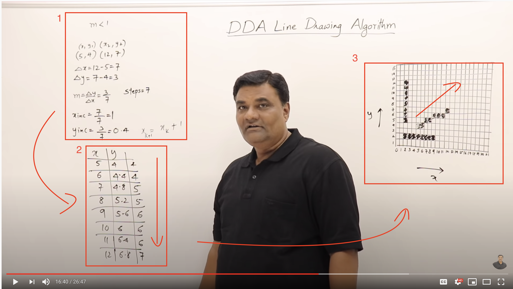

# Intro to Intro to Raycasting--#5

> "*...If you don't know, now you know..."* - **Notorious B.I.G** (1994)

이 글은 필자가 [42 Seoul](http://42seoul.kr) 에서 주어진 프로젝트 과제인 'cub3d'—울펜슈타인 3D의 엔진을 C로 재현 해보는—과제를 진행 하면서 보고 배우고 느낀 점들을 정리 하기 위해 작성한 글이다.

[Lodev.com](http://lodev.com) 의 'Intro to Raycasting' 을 읽기 이전에, 문서에서 나온 부분에 관련 지식 기반이 전혀 없는 상태에서 글을 읽어보기 전 어떤 점들을 알아야 하고, 학습을 학습하는데 도움을 위한 목적으로 작성하였다.


---
#### II2R--Intro to Intro to Raycasting
#### 👉 <a href="https://github.com/sungyongcho/ii2r/blob/master/md/1.md">#1</a>
#### 👉 <a href="https://github.com/sungyongcho/ii2r/blob/master/md/2.md">#2</a>
#### 👉 <a href="https://github.com/sungyongcho/ii2r/blob/master/md/3.md">#3</a>
#### 👉 <a href="https://github.com/sungyongcho/ii2r/blob/master/md/4.md">#4</a>
#### 👉 <a href="https://github.com/sungyongcho/ii2r/blob/master/md/5.md">#5</a>
#### 👉 <a href="https://github.com/sungyongcho/ii2r/blob/master/md/6.md">#6</a>
---

42 Seoul 이란?

👉[https://42seoul.kr/about](https://42seoul.kr/about)

---

42?

👉[https://www.42.fr/](https://www.42.fr/)

---
<br>

## #5

이제 진짜로 로데브 사이트로 들어 가보자.

- Lode's Computer Graphics Tutorial
    - [https://lodev.org/cgtutor/raycasting.html](https://lodev.org/cgtutor/raycasting.html)
        - 파트 3 까지 있음 (페이지 맨 끝에 다음 파트로 넘어갈 수 있는 링크가 있음)
    - 한글 번역
        - Part 1: [https://github.com/365kim/raycasting_tutorial](https://github.com/365kim/raycasting_tutorial) (@mihykim)
        - Part 2: [https://github.com/l-yohai/cub3d/blob/master/mlx_example/floor_ceiling.md](https://github.com/l-yohai/cub3d/blob/master/mlx_example/floor_ceiling.md) (@yohlee)
        - Part 3: [https://github.com/l-yohai/cub3d/blob/master/mlx_example/sprite.md](https://github.com/l-yohai/cub3d/blob/master/mlx_example/sprite.md) (@yohlee).

<br>

<p float="left" align="center">
	
	
</p>

<br>
음 읽어 봤는데... 도통 뭔 소린지 잘 모르겠다..... 라고 생각 할 수 있으나, 결국에는 이때까지 내가 말하고 싶은 부분을 좀더 상세하게 풀어 놓은 문장들이다. [https://github.com/365kim/raycasting_tutorial/blob/master/2_basics.md](https://github.com/365kim/raycasting_tutorial/blob/master/2_basics.md) 해당 페이지를 기준으로 첫번째 bullet point를 조금만 천천히 읽어보면 결국에는

```
- 가상의 그리드위에 나의 좌표위치 (x, y) 로 부터 벽의 위치까지 레이저빔을 쏴서,
- 이 레이저빔이 벽을 만나면 벽을 뽑아내 주면 된다
```

라는 이야기를 하고 있다. 이걸 어떻게 구현 할 것인가를, '로데브'는 DDA 알고리즘을 응용한 레이캐스팅 알고리즘을 사용하겠다고 한다는 것이다.

```
이 튜토리얼에서는 DDA(Digital Differential Analysis) 기반으로 하는 알고리즘이 사용됩니다.

DDA 알고리즘은 2차원 그리드를 지나가는 선(line)이 어떤 네모칸과 부딪히는지 찾을 때 일반적으로 사용되는,
속도가 빠른 알고리즘입니다. 그래서 이 알고리즘을 사용해서 광선이 맵에서 어떤 네모칸이랑 부딪히는지
찾아낼 수 있고, 벽에 부딪힌 것이 확인되면 이 알고리즘은 중단됩니다.
```

DDA알고리즘을 기반으로 한 레이캐스팅 알고리즘을 구현하였다고 하였는데... #3(링크삽입)에서 DDA알고리즘에 대한 자료를 찾아보고 영상을 시청 하였다면 해당 부분에 대한 약간의 감을 찾을 수 있을텐데, 그래도 DDA알고리즘을 다시 한번 살펴 보자면...

<p align="center">
	
	<small align="center"> 이 이미지 안에 DDA알고리즘의 모든것이 담겨있다.</small>
</p>

1.

- (식의 기울기가 0보다 작을때만 놓고) 주어진 x의 값들에 따라, y의 값들이 변하는 하나의 선이 있다.
- 시작점의 좌표는 (5, 4) 이고 끝점의 좌표는 (12, 7) 일때, x의 변화량과 y의 변화량은 각각 Δx = 7 (12-5) Δy = 3 (7-4)이다.

 <p align="center">
	
</p>

- 그러면 우리는 아래의 공식을 통해서 m의 값, **기울기**를 알게 되고 (이때 b의 값은 문제, 식, 사진 어디에서도 주어지지 않았으므로 0), 이 아래의 x_inc 와 y_inc의 값을 통해 서도 알수 있듯이, x가 1씩 증가할 때, y의 값은 0.4 씩 증가하게 된다는 것을 알 수 있게 된다.

<p align="center">
	
</p>

- 다시 이야기 해서, Steps = 7 의 경우 x가 1씩 7번 증가를 하게 될때, y의 값은 상대적으로 0.4 씩 증가하게 된다는 것이다.

2.

- 위에서 나온 수식을 표로 표현 한 것이다. x가 5일때 y의 값은 4이고, x가 6일때 y의 값은 (**0.4씩 증가하기때문에**) 4.4가 되고, x=7 일때, y=4.8이 되고... 12까지 계속 0.4를 더하게 된다.
- 그런데, 여기서 DDA 알고리즘에 이용하기 위해, 소수점 아래의 값들을 반올림 해 주어야 하는데, 우리가 지금 눈으로 보고 있는 **하나의 점** 의 단위는 **픽셀(pixel;px)** 등으로 나타내게 되고, 이 점의 단위는 소수점의 단위를 가지지 않는다.

```
...디지털 이미지는 자연계에 존재하는 어떤 사물, 혹은 장면을 이미지 센서를 통해 디지털 값들의 집합으로
표현 한 것이다...
...외부의 어떤 장면이 카메라 렌즈를 거쳐 디지털 이미지로 형상이 되기 까지 몇가지 좌표계를 거치게 된다...
...이미지를 이루는 가장 작은 단위를 픽셀(pixel)이라 하는데, 이미지를 이루는 점들이라고 생각하면 된다...

- 출처 : 디지털 이미지의 표현과 크기 계산법 - Learn Again! 러너게인
				(https://twlab.tistory.com/23)
```

- 각 픽셀(소수점을 버린, 자연수)의 지점에 우리가 보는 화면의 픽셀에 점을 찍기 위해, 각각의 수를 반올림 해주게 되면, 표의 세번째 열의 값들을 구할수 있게 된다.

3.

- 이를 좌표계에 그대로 그리게 되면, 반올림이 되어 완벽한 직선의 형태를 띄지 않을 수 있지만,  하나의 픽셀에 점을 찍어 해당 픽셀의 공간을 차지할 수 있게 된다. (해당 픽셀에 점을 찍을수 있다 정도로 생각하자)


이 DDA 알고리즘을 바탕과 앞부분에서 '광선'을 통해 배우게 된 내용으로 실마리를 잡기 위해, '로데브'의 레이캐스팅 알고리즘의 원리를 약간 스포 해 보자면...
- '플레이어의 위치'를 시작점으로 두고 광선을 쏘기 시작하고, x의 증가의 값에 따라 y의 값이 증가 할 때
- 진행을 하기에 앖어 해당 위치에서 '벽'을 만나게 된다면?
- 광선의 진행을 멈추고 해당 위치에 벽이 있다는것을 기록 후,
- 다음 시야각에 해당하는 '광선'을 쏘아 해당 과정을 반복한다.
- 내 시야각에 해당하는 광선들을 모두 다 쏘아 위치를 파악했다면, 캐스팅은 종료한다.

```
필자의 내용이긴 하지만, 혹시 x좌표의 수평인 직선과 y좌표의 수평인 직선이 보여, 벡터로
구현을 해 봄직 하겠다 싶으시다면, 이미 이 글은 너무 쉬운 내용이기 때문에
바로 구현으로 넘어가셔도 됩니다..^^;
```
이제 DDA 알고리즘을 대략적으로 알았으니, 이를 활용해서 '로데브'를 읽을 준비를 마쳐보자!

## 👉 <a href="https://github.com/sungyongcho/ii2r/blob/master/md/6.md"> #6 보러가기</a>
