# Intro to Intro to Raycasting--#6

> "*...If you don't know, now you know..."* - **Notorious B.I.G** (1994)

이 글은 필자가 [42 Seoul](http://42seoul.kr) 에서 주어진 프로젝트 과제인 'cub3d'—울펜슈타인 3D의 엔진을 C로 재현 해보는—과제를 진행 하면서 보고 배우고 느낀 점들을 정리 하기 위해 작성한 글이다.

[Lodev.com](http://lodev.com) 의 'Intro to Raycasting' 을 읽기 이전에, 문서에서 나온 부분에 관련 지식 기반이 전혀 없는 상태에서 글을 읽어보기 전 어떤 점들을 알아야 하고, 학습을 학습하는데 도움을 위한 목적으로 작성하였다.


### II2R--Intro to Intro to Raycasting
---
#### 👉 <a href="https://github.com/sungyongcho/ii2r/blob/master/md/1.md">#1</a>
#### 👉 <a href="https://github.com/sungyongcho/ii2r/blob/master/md/2.md">#2</a>
#### 👉 <a href="https://github.com/sungyongcho/ii2r/blob/master/md/3.md">#3</a>
#### 👉 <a href="https://github.com/sungyongcho/ii2r/blob/master/md/4.md">#4</a>
#### 👉 <a href="https://github.com/sungyongcho/ii2r/blob/master/md/5.md">#5</a>
#### 👉 <a href="https://github.com/sungyongcho/ii2r/blob/master/md/6.md">#6</a>
---

42 Seoul 이란?

👉[https://42seoul.kr/about](https://42seoul.kr/about)

---

42?

👉[https://www.42.fr/](https://www.42.fr/)

---
<br>

## #6
드디어 마지막 포스팅이다! #5번에서 이야기 한 것 처럼,

```
- '플레이어의 위치'를 시작점으로 두고 광선을 쏘기 시작하고, x의 증가의 값에 따라 y의 값이 증가 할 때
- 진행을 하기에 앖어 해당 위치에서 '벽'을 만나게 된다면?
- 광선의 진행을 멈추고 해당 위치에 벽이 있다는것을 기록 후,
- 다음 시야각에 해당하는 '광선'을 쏘아 해당 과정을 반복한다.
- 내 시야각에 해당하는 광선들을 모두 다 쏘아 위치를 파악했다면, 캐스팅은 종료한다.
```

대략적인 방식이라는 것에 이제 슬슬 감이 집히기 시작하는데,

다시한번 설명하지만, 이 글은 Intro to Intro to Raycasting이지, Intro to Raycasting이 아니기 때문에 해당 글을 읽고 '로데브'의 글을 다시한번 꼭 읽어 보아야 한다!

이제부터 직접 구현 예제에서 벡터 어떻게 쓰여졌는지, 이에 관한 배경지식을 정리하는 것으로 마무리 하려고 한다.

입아프지만, 한번더 설명하지만, ***이 글은 Intro to Intro to Raycasting이지, Intro to Raycasting이 아니기 때문에 해당 글을 읽고 '로데브'의 글을 다시한번 꼭 읽어 보아야 한다!***

<p align="center">
	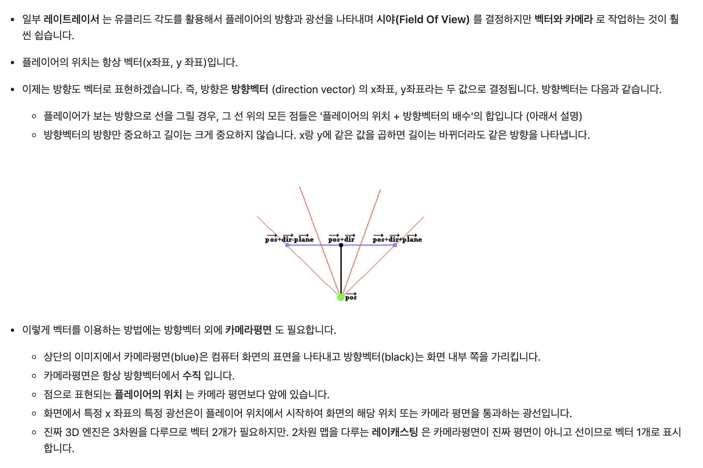
</p>

위 사진에도 나와있듯이, 위의 방법에서 각도를 회전 시키고 시야각의 범위를 구하는 등등의 과정을 이용할 때  '방향벡터'와 '카메라'를 이용한다고 나와있다. 당장 방향벡터와 시야각이 쓰이는 곳에 대한 개념 설명은 나와있지만 구현부에서 왜 해당 부분의 벡터 계산법이 중요한지 알아보아야 한다.

바로 예제 코드로 넘어 가보자.

- 개념 설명은 →

    [https://github.com/365kim/raycasting_tutorial/blob/master/2_basics.md](https://github.com/365kim/raycasting_tutorial/blob/master/2_basics.md)

    [https://github.com/365kim/raycasting_tutorial/blob/master/3_untextured_raycaster.md](https://github.com/365kim/raycasting_tutorial/blob/master/3_untextured_raycaster.md)

- 코드는 →

    [https://github.com/l-yohai/cub3d/blob/master/mlx_example/01_untextured_raycast.c](https://github.com/l-yohai/cub3d/blob/master/mlx_example/01_untextured_raycast.c)

```
코드 구현 예제 부분은 '로데브'의 원본이 아니라 저를 비롯한 이 글을 읽으실 분들에게는
C 코드가 더 익숙한 상황이기 때문에 C로 재작성된 코드를 보고 설명을 이어가겠습니다.
```
<p align="center">
	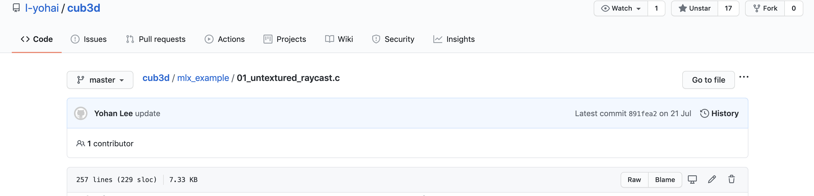
</p>
<p align="center">
	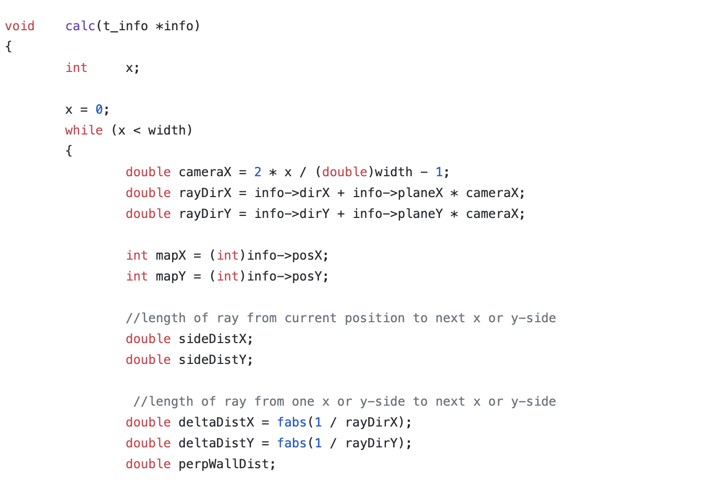
</p>

선언부

cameraX 부분은 넘어가고, rayDirX와 rayDirY의 값에 비슷한 식이, deltaDistX와 deltaDistY에 비슷한 식이 있는것을 알 수 있다.

그리고 본문에 아래와 같은 deltaDistX, deltaDistY 와 같은 대각선의 거리가 나와있는 것도 볼 수 있다.

<p align="center">
	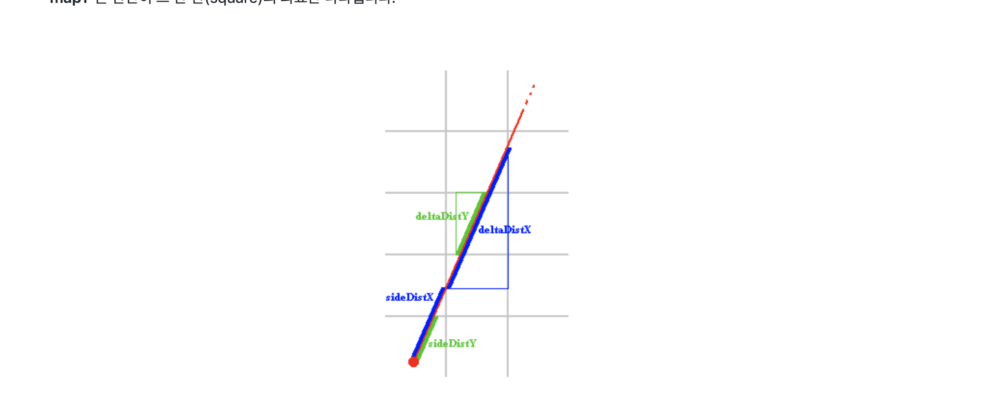
</p>


<p align="center">
	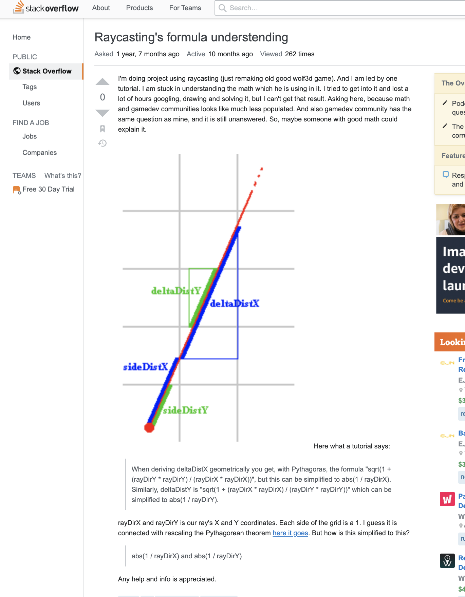
	<small>동서고금을 막론하고...</small>
</p>


 StackOverflow에도 비슷한 질문이 나와 있는데, 해당 함수에 들어가기 전 우선적으로 할당 되어 있는 값이 있는지도 살펴보자.

<p align="center">
	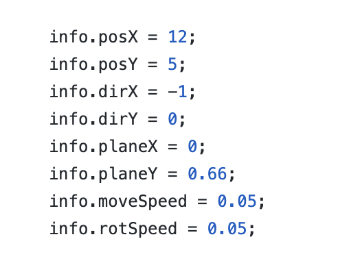
</p>

<p align="center">
	
	<br>
	<small>빨간 줄부분은 과제 할 때 필요한 부분이 아니라 줄그어 놓았습니다...</small>
</p>

해당 값들을 다시 잘 뜯어 보면

- posX, posY는 플레이어의 위치
- dirX, dirY는 초기 방향벡터
- planeX, planeY는 카메라 벡터 와 관련이 있는듯 해보이고
    - 카메라 벡터의 경우, 시야각이 0:0.66으로 놓았을 때가 자연스럽게 보이기 때문에 (본문에 나와있음)
- moveSpeed, rotSpeed의 경우 키 입력시 화면 전환을 할때 변화를 주기 위해서 쓰이는 값 처럼 보인다.

처럼 보이는것 같다.

다시 코드부분으로 넘어가자면 (...)

<p align="center">
	
</p>

<p align="center">
	
</p>


<p align="center">
	
</p>

이제 각 변수에서 미리 지정된 값이 어떤 값인지 알기 때문에 각각의 변수가 어떤 역할을 하는지 알아야 한다.

rayDirX,Y의 이름에서 유추 하여 볼 수 있듯이, cameraX의 값이 while문 안에 포함되어 있기 때문에 x의 값에 따라 변하는 ***카메라 평면***  에따라 달라지는 광선의 방향을 나타내는 것을 알 수 있다.

[그림삽입예정]

그렇다면 deltaDistX 는 어디서 갑자기 왜 튀어 나왔을까? 해당 수식을 변환화여 값이 어떻게 구해지는가를 알아야 한다. 그 이전에, 본문을 잘 읽어 보았다면 이해 되겠지만, 왜 deltaDistX와 deltaDistY 가 생기는지는, 각 delta의 값이 수평 그리드와 수직 그리드를 대상으로 각 칸 사이의 거리를 재는것이기 때문이다. 그리고 이 칸 사이이의 거리는, **_동일한 한 줄의 광선에서는, 다음 칸까지의 deltaDistX,와 deltaDistY는 모두 동일할 수 밖에 없다. 왜냐하면 광선은 직선이기 때문이다.**

~~광선을 구하는것 까지는 알겠는데, deltaDistX나 deltaDistY의 수식이 우리가 쉽게 알고 있는 피타고라스의 정이 등을 사용하면 될 것 같은데, 벡터를 사용하게 된 이유는, 삼각함수를 사용하게 될 경우 1.소숫점을 포함하게 되면서 계산이 느려질 수도 있고 (정리필요함 확실하지않음), 2. 벡터로 변경하는것이 눈으로 보기에도 쉽다. 그래서 이 식이 어떻게 변형 되는지에 대하여 증명한 것을 살펴보자.~~
👉 아래 업데이트 부분 확인 부탁드립니다

<p align="center">
	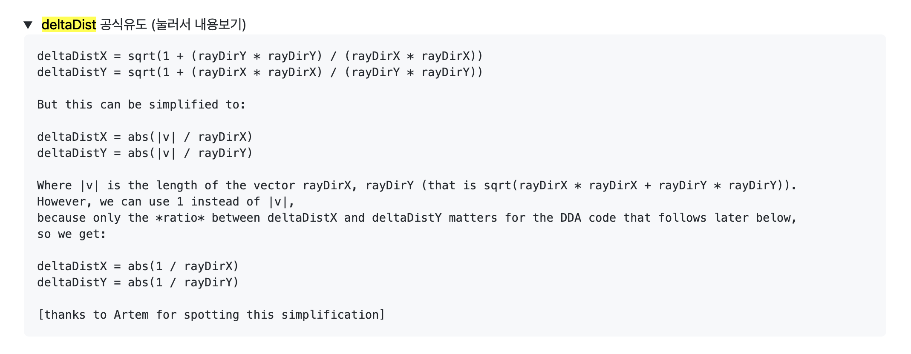
	<small>can be simplifilied.. but how?</small>
</p>


간략본

rayDirX, rayDirY를 간략하게 두기 위해 x, y로 놔두고 식을 새로 써보면

<p align="center">
	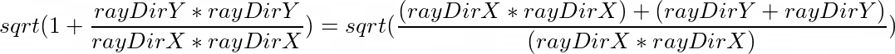
</p>


로 나타낼 수 있고, rayDir의 길이는 항상 1, ~~(왜냐하면 각 칸의 길이는 1이기 때문에)

~~(x * x + y * y) 는 1이 되어, sqrt(1/(x*x)) 를 abs(1/x)로 나타낼 수 있다.~~

도움을 받아 직접 풀어 해쳐본 방법: (@minckim 님께 다시한번 감사드립니다)

<p align="center">
	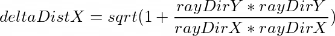
</p>

<p align="center">
	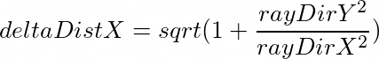
</p>

<p align="center">
	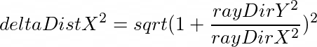
</p>

<p align="center">
	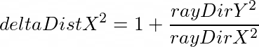
</p>

를 도출 하였는데, 이때까지만해도 뭐가 뭔지 하나도 몰랐다. 그러나... 삼각함수를 통해 **x 증분에 대한 빗변의 길이** 를 도출하는 공식인것 같다는 동료분의 도움을 얻고, 삼각함수를 활용하여 다시 식을 도출 해보았는데..

<p align="center">
	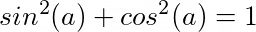
</p>

<p align="center">
	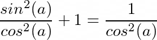
</p>


<p align="center">
	
</p>

<p align="center">
	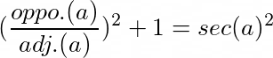
</p>

<p align="center">
	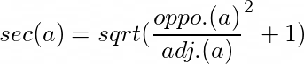
</p>


~~여기서~~

- ~~sec(a) = 빗변의 길이 / 밑변의 길이 (== a(각도) = sec^-1(빗변의 길이/ 밑변의 길이)~~
    - ~~우리가 구하고 싶은 값 : 길이~~
    - ~~**sec(a) * 밑변의 길이 = 빗변의 길이**~~
        - ~~(sec(1) = 1/cos(a))~~


~~인것을 알수 있고, 우리가 구하고 싶은 값인 deltaDist의 값에 해당되기 때문에 해당 공식을 도출 해 볼 수가 있다.~~

식을 풀어 헤치고 나서 느꼈지만, 벡터의 개념을 알고 있다면 매우 손쉽게 계산식을 도출 해 낼 수 있는 것 같다.

## UPDATE (2020. 10. 13)
---
- deltaDistX = abs (1 / rayDirX) // deltaDistY = abs (1 / rayDirY) 에서 왜 1이 쓰이는가..
- II2R 업로드를 마치고 나서 |v|의 부분이 1로 쓰이는지에 대한 잘못된 정보가 있어 다시 학습한 부분을 정리했습니다.
- 다시한번 해당부분 정리할수 있게 해주신 @eun-park, @minckim, @kycho 님께 감사드립니다.
---
__결론__: 1의 값은 어떤 값이 들어가도 상관이 없다. deltaDistX, deltaDistY (__광선에 진행에 따라 증가하게되는 '선'의 길이__)는 결국 벽(이나 피사체)의 '플레이어의 위치'로 부터 상대적 거리를 나타내기 위한 거리로 사용되고, 이 거리들은 어떤 벽이 좀더 멀리있고 가까운지 '비율'이 중요하다는 것만 확실히 한다면, |v|를 대신하는 1의 경우 어떤값이 들어가게 되도 상관없다.


일단 영상...

<p float="left" align="center">
	<a href="https://youtu.be/V0chA5VqTSk"></img></a>
	<a href="https://youtu.be/X4dnN4SvAn8"></img></a>
	<br>
	<small>증거영상들.. 값을 1로도 줘보고 1000으로도 줘봤다..</small>
</p>

정리를 하면서 혼동이 올 수 있는 부분은..
<p align="center">
	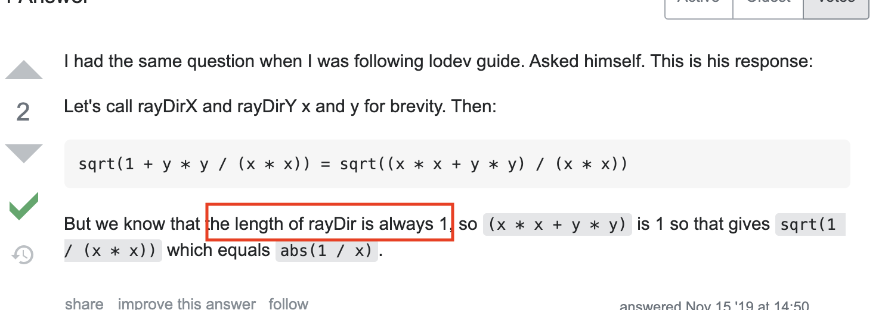
	<small>아....</small>
</p>
빨간 박스의 부분에서 rayDir가 항상 1로 고정이 되어있다는 부분인데, rayDir가 항상 1이 된다는 부분에 조심 해야하는게, rayDirX, rayDirY와 혼동이 되어서는 안된다!! 결국에는 비율이 중요한데,
<p align="center">
	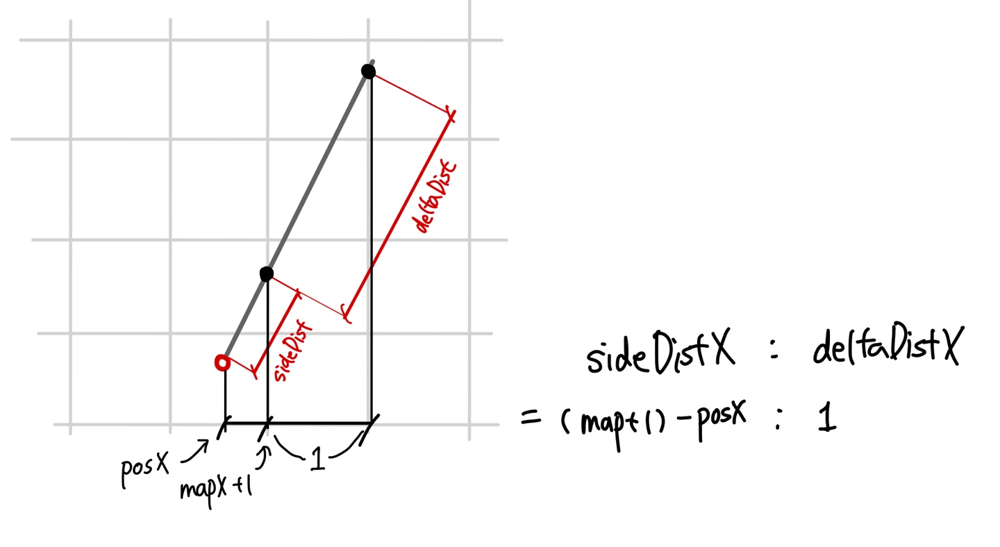
	<small>(c)365kim</small>
</p>

__위와 같이 아래의 비율로 해결이 된다는 것을 알야야 한다 !!__

<br>

자 이제 모든 준비는 끝났다.

수학적인 이해도 모두 정리가 되었고, 이제 레이캐스팅을 직접 구현 해 볼 차례이다. 다시한번 말 하지만, 이 글을 순차적으로 읽었다면 당연한 과정인것을 알겠지만, ***이 글은 Intro to Intro to Raycasting이지, Intro to Raycasting이 아니기 때문에 해당 글을 읽고 '로데브'를  다시한번 꼭 읽어 보아야 한다!*** 왜냐하면 이 글에는 cub3D 과제를 완수하기 정보가 모두 나와있지 않기 때문이다.

지금 정리 한 내용을 바탕으로, '로데브' 글을 읽어 보았을 때 조금이라도 이해에 더 도움이 되었으면 한다.

## 👉 <a href="https://lodev.org/cgtutor/raycasting.html">'로데브' 보러가기</a>
## 👉 <a href="https://github.com/365kim/raycasting_tutorial">한글 번역본</a>
