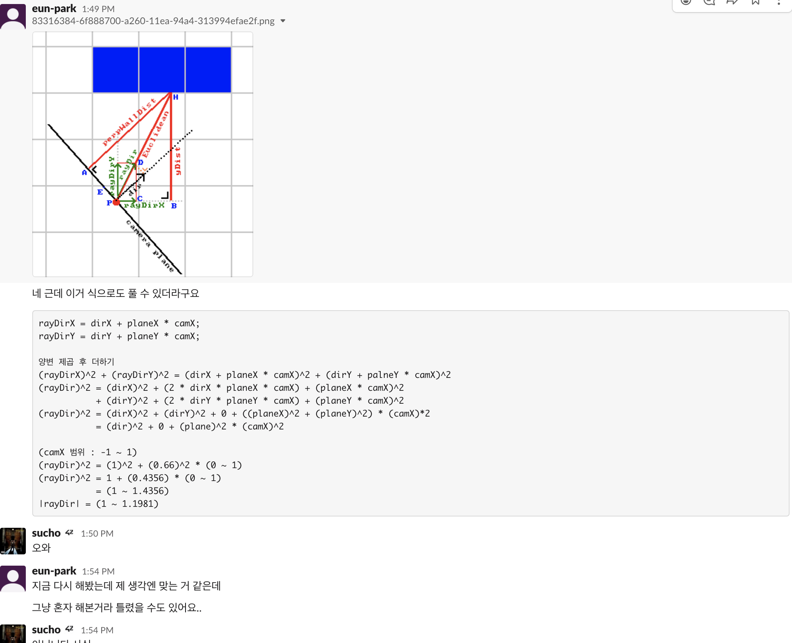
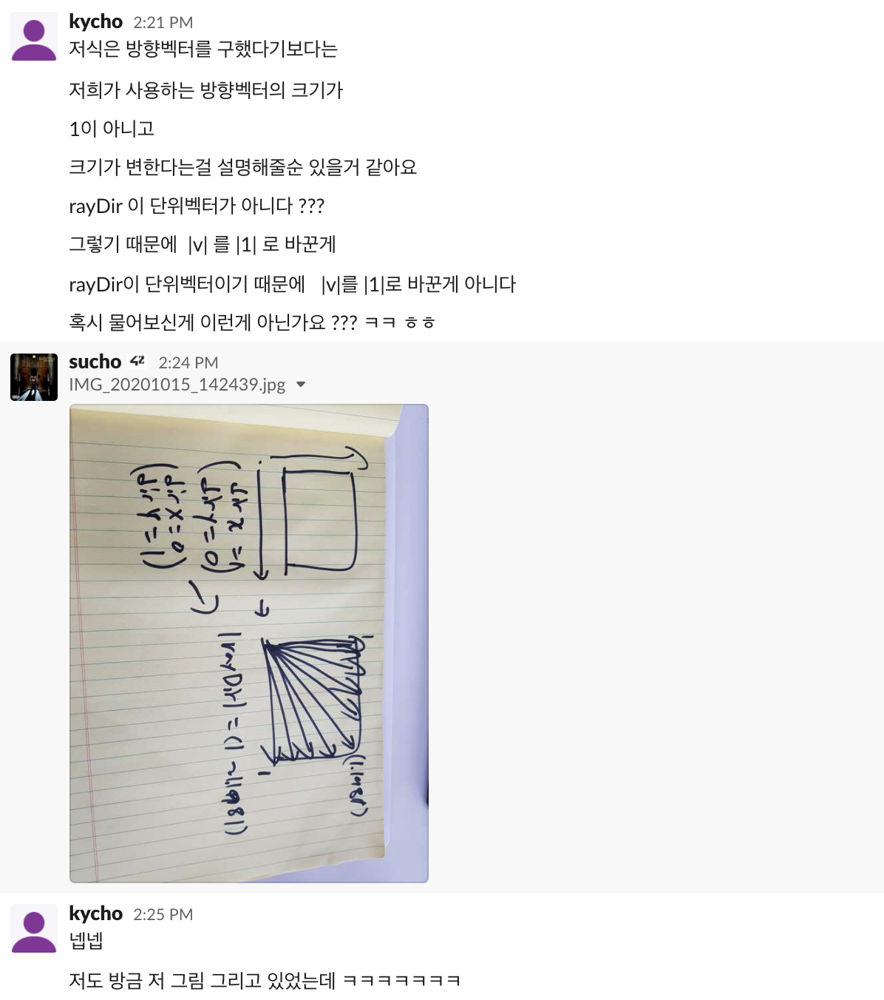
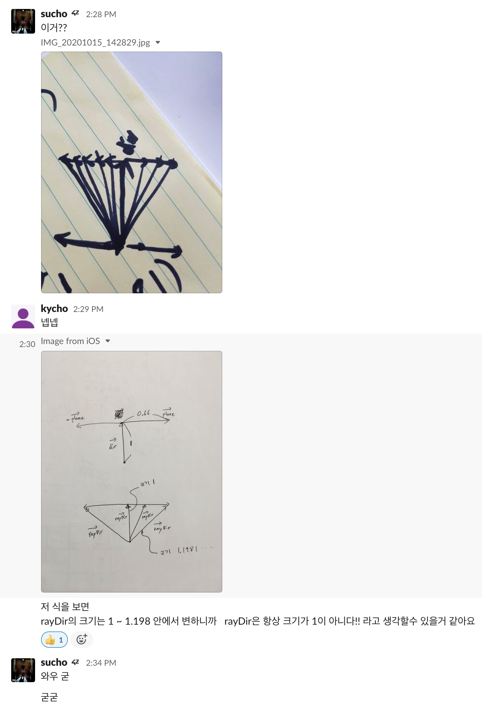

# Intro to Intro to Raycasting--#6_2

> "*...If you don't know, now you know..."* - **Notorious B.I.G** (1994)

이 글은 필자가 [42 Seoul](http://42seoul.kr) 에서 주어진 프로젝트 과제인 'cub3d'—울펜슈타인 3D의 엔진을 C로 재현 해보는—과제를 진행 하면서 보고 배우고 느낀 점들을 정리 하기 위해 작성한 글이다.

[Lodev.com](http://lodev.com) 의 'Intro to Raycasting' 을 읽기 이전에, 문서에서 나온 부분에 관련 지식 기반이 전혀 없는 상태에서 글을 읽어보기 전 어떤 점들을 알아야 하고, 학습을 학습하는데 도움을 위한 목적으로 작성하였다.


### II2R--Intro to Intro to Raycasting
---
#### 👉 <a href="https://github.com/sungyongcho/ii2r/blob/master/md/1.md">#1</a>
#### 👉 <a href="https://github.com/sungyongcho/ii2r/blob/master/md/2.md">#2</a>
#### 👉 <a href="https://github.com/sungyongcho/ii2r/blob/master/md/3.md">#3</a>
#### 👉 <a href="https://github.com/sungyongcho/ii2r/blob/master/md/4.md">#4</a>
#### 👉 <a href="https://github.com/sungyongcho/ii2r/blob/master/md/5.md">#5</a>
#### 👉 <a href="https://github.com/sungyongcho/ii2r/blob/master/md/6.md">#6</a>
#### 👉 <a href="https://github.com/sungyongcho/ii2r/blob/master/md/6_2.md">#6_2</a>
---

42 Seoul 이란?

👉[https://42seoul.kr/about](https://42seoul.kr/about)

---

42?

👉[https://www.42.fr/](https://www.42.fr/)

---
<br>

## #6_2

```
이전 단계에서 rayDir에 대해 찝찝한 부분이 있었다면 아래의 부분을 확인 하시면 수학적인 이해도가 약간은 해소 되지 않을까 합니다
정리를 마친 이후에도 도움을 주신 @eun-park, @minckim, @kycho님께 또, 다시한번 감사의 말씀을 전합니다 (- -) (_ _) (- -)
```

|v|가 갑자기? 어떤 값이든 설명이 되는 것에 대해서, 1로 쓰여 질 수 있다는 점에서 약간의 찝찝함을 버리지 못하고 연락을 받게 되었다.


<p align="center">
	
</p>

오잉? 진짜 식을 대입해서 풀 수 있네?

해당 과정에 생략된 부분이 있기 때문에 하나하나 조목조목 뜯어 보기로 하자.

<p align="center">
	
</p>
<p align="center">
	
</p>

<p align="center" style="font-size:large">양변 제곱 후 더하기</p>

<p align="center">
	
</p>
<p align="center" style="font-size:xx-large">
	∵ 
</p>

<p align="center">
	
	
	
</p>

<p align="center">
	
</p>

<p align="center"  style="font-size:xx-large">
	
	<br>
	∵
	<br>
	
</p>

<p align="center">
	
</p>

<p align="center"  style="font-size:large">
	(camX 범위 : -1 ~ 1)
	<br>
	
	<br>
	
	<br>
	
	<br>
	
</p>

```
∵ <- 이 문자가 수식 사이에서 작게 보이실 수도 있을텐데요.. 수학에서 (because)라는 뜻입니다.. 참고 부탁드려요!
```
중간즈음... 갑자기 0이 튀어나오는 부분의 검색 키워드는 '벡터 내적' 으로 찾아 공부 해보자!

이 과정에서 결국 |v|가 의미 하는것은...

<p align="center">
	
</p>

<p align="center">
	
</p>

그렇다... 이로써 혹시라도 rayDir과 |v|에 대해 의문점이 모두 해소 되었으면 한다!!

## 👉 <a href="https://lodev.org/cgtutor/raycasting.html">'로데브' 보러가기</a>
## 👉 <a href="https://github.com/365kim/raycasting_tutorial">한글 번역본</a>
